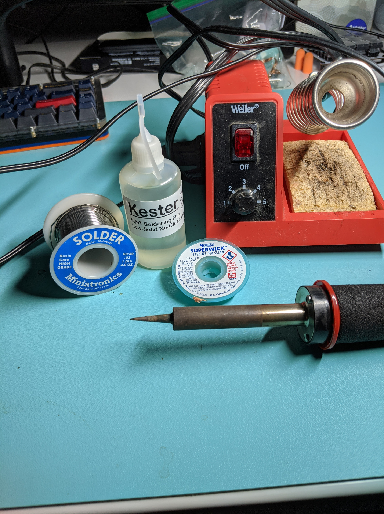

# GergoPlex Build

## My Build log for [GergoPlex Kit](https://www.gboards.ca/product/gergoplex)

This kit comes with [SMD](https://en.wikipedia.org/wiki/Surface-mount_technology) parts that are small and fun to solder.  

## Parts list
Resistors:
* 2x2.2k labeled 222
* 2x22k labeled  22R0
* 2x10k labeled 103

Capacitors:
* 5x0.1uf
* 2x22pf
* 1x1uf

Diodes
??x diodes 

Chips:
* 1x AtmelMega32U4
* 1x MCP23018 IO port expander

Other:
* 1x oscillator 
* 1x reset switch
* 9x rubber dot feet
* 1x usb connector
* 2x trrs connectors

## Build Notes
[Reference Layout](./images/gergoplex.pdf)

### Step 1
I decided to solder the diodes first, The diodes have a small line on one side, that side should be sitting on a square pad. *Note*: it is important to get the direction correct.

## Step 2 
Next I did the capacitors, these are all brown in my case and have no direction they have to be in. So let's first install the 2x22pf next to the  oscillator, Go ahead and solder in the oscillator also. 

Next lets install the single 1uf right under the AtmelMega32U4 labeled C3  on the [Reference Layout](./images/gergoplex.pdf).

Now you have 5 (0.1uf) todo, 4 are all lined up together (C6,C5,C7,C8) and the last one C4.

## Step 3
All 6 resistors are together they have no direction, it's just a matter of getting the right sizes in the the right place.

Check the images but it should be in the direction going towards capacitor 
* 222
* 222
* 103
* 103
* 22R0
* 22R0
* 0.1uf cap

## Step 4
IO expander and the CPU. These will be fun but this is what you came for right?
[What it should look like](https://www.youtube.com/watch?v=b9FC9fAlfQE) You can validate the direction if the chip with the other photos.

After that looks nice ;) go ahead and get the usb, trrs, and reset switch on.

At this point I recommend  getting the board programmed and tested with tweezers (carefully).

If all checks out, get those switches on ASAP!

I used the build instructions for the Gergo and a little help from @germ. 

[Here](http://docs.gboards.ca/docs/Gergo-Setup/) and [Here](https://github.com/germ/GergoDocs) are the directions I used to build, these notes are just my attempt to answer some of the questions I had, based on the differences between the 2 boards.

Here are the tools I used to get this build done.
